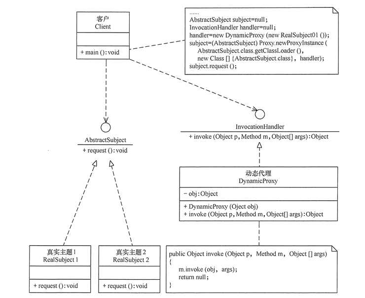

# 代理模式
代理模式的定义：由于某些原因需要给某对象提供一个代理以控制对该对象的访问。这时，访问对象不适合或者不能直接引用目标对象，代理对象作为访问对象和目标对象之间的中介。

代理模式的主要优点有：
 - 代理模式在客户端与目标对象之间起到一个中介作用和保护目标对象的作用；
 - 代理对象可以扩展目标对象的功能；
 - 代理模式能将客户端与目标对象分离，在一定程度上降低了系统的耦合度，增加了程序的可扩展性

其主要缺点是：
 - 代理模式会造成系统设计中类的数量增加
 - 在客户端和目标对象之间增加一个代理对象，会造成请求处理速度变慢；
 - 增加了系统的复杂度；

根据代理的创建时期，代理模式分为静态代理和动态代理。
 - 静态：由程序员创建代理类或特定工具自动生成源代码再对其编译，在程序运行前代理类的 .class 文件就已经存在了。
 - 动态：在程序运行时，运用反射机制动态创建而成

## 代理模式的应用场景
当无法或不想直接引用某个对象或访问某个对象存在困难时，可以通过代理对象来间接访问。使用代理模式主要有两个目的：一是保护目标对象，二是增强目标对象。

前面分析了代理模式的结构与特点，现在来分析以下的应用场景。
 - 远程代理，这种方式通常是为了隐藏目标对象存在于不同地址空间的事实，方便客户端访问。例如，用户申请某些网盘空间时，会在用户的文件系统中建立一个虚拟的硬盘，用户访问虚拟硬盘时实际访问的是网盘空间。
 - 虚拟代理，这种方式通常用于要创建的目标对象开销很大时。例如，下载一幅很大的图像需要很长时间，因某种计算比较复杂而短时间无法完成，这时可以先用小比例的虚拟代理替换真实的对象，消除用户对服务器慢的感觉。
 - 安全代理，这种方式通常用于控制不同种类客户对真实对象的访问权限。
智能指引，主要用于调用目标对象时，代理附加一些额外的处理功能。例如，增加计算真实对象的引用次数的功能，这样当该对象没有被引用时，就可以自动释放它。
 - 延迟加载，指为了提高系统的性能，延迟对目标的加载。例如，Hibernate 中就存在属性的延迟加载和关联表的延时加载。

在前面介绍的代理模式中，代理类中包含了对真实主题的引用，这种方式存在两个缺点。
 - 真实主题与代理主题一一对应，增加真实主题也要增加代理。
 - 设计代理以前真实主题必须事先存在，不太灵活。采用动态代理模式可以解决以上问题，如 SpringAOP，其结构图如图所示。

