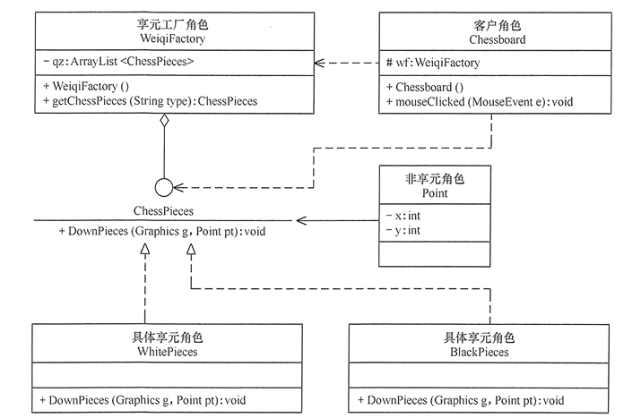

## 享元模式的应用实例

* 享元模式在五子棋游戏中的应用。

* 分析：五子棋同围棋一样，包含多个“黑”或“白”颜色的棋子，所以用享元模式比较好。

* 本实例中:
   - 棋子（ChessPieces）类是抽象享元角色，它包含了一个落子的 DownPieces(Graphics g,Point pt) 方法；
   - 白子（WhitePieces）和黑子（BlackPieces）类是具体享元角色，它实现了落子方法；
      - Point 是非享元角色，它指定了落子的位置；
      - WeiqiFactory 是享元工厂角色，它通过 ArrayList 来管理棋子，并且提供了获取白子或者黑子的 getChessPieces(String type) 方法；
      - 客户类（Chessboard）利用 Graphics 组件在框架窗体中绘制一个棋盘，并实现 mouseClicked(MouseEvent e) 事件处理方法，该方法根据用户的选择从享元工厂中获取白子或者黑子并落在棋盘上。

